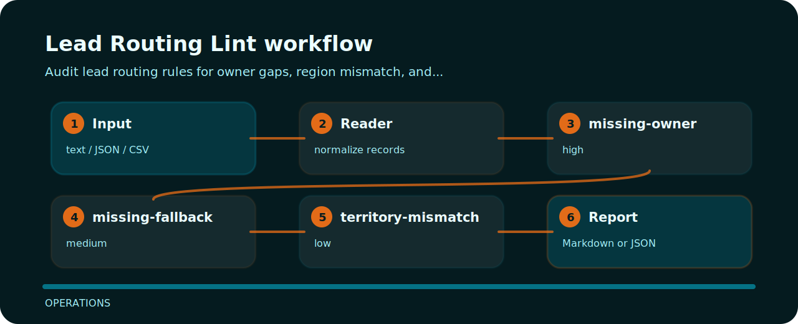

# Lead Routing Lint


Audit lead routing rules for owner gaps, region mismatch, and fallback behavior. The command is intentionally direct so it can sit in a local review, a CI step, or a one-off audit.

## Files to open first

```text
.github/        CI workflow
examples/       sample inputs
src/            package source
tests/          test coverage
```

## Rule ledger

| Signal | Level | What it flags | Fix direction |
| --- | --- | --- | --- |
| `missing-owner` | high | lead owner missing | assign route owner |
| `missing-fallback` | medium | fallback route missing | add fallback queue |
| `territory-mismatch` | low | territory mismatch detected | verify territory mapping |

## Signal route



## Command path

```bash
git clone https://github.com/mertefekurt/lead-routing-lint.git
cd lead-routing-lint
python -m pip install -e ".[dev]"
lead-routing-lint examples/sample.txt
```
